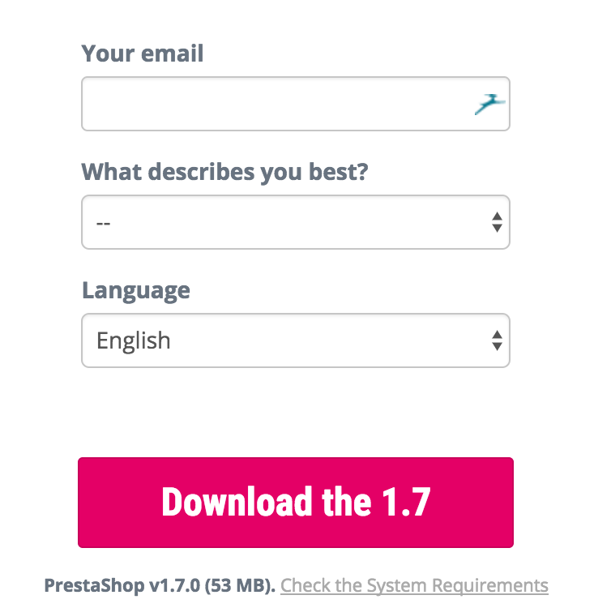
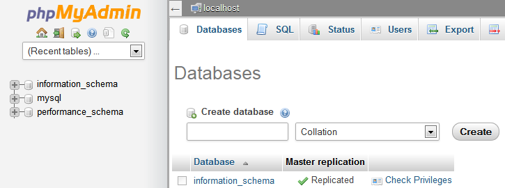
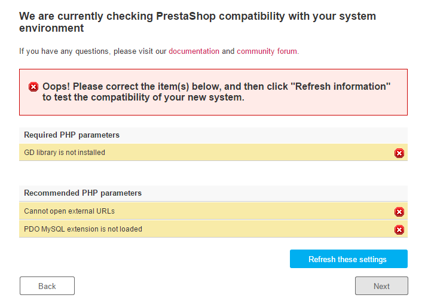
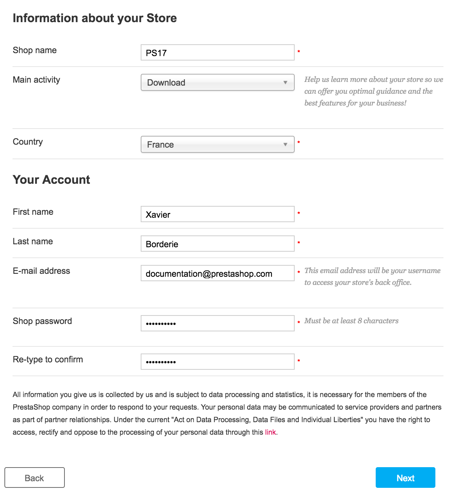
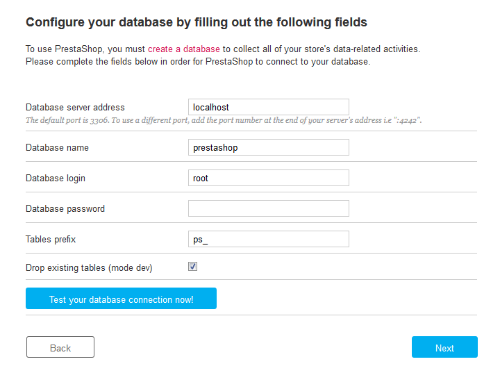

# Installing PrestaShop

This chapter was written for those who intend to install PrestaShop on their online web server.  
If you wish to install PrestaShop on your own computer, you should first follow the instructions on that page: [Installing PrestaShop on your computer](installing-prestashop-computer.md).

If you have already read the instructions on that page, skip to the "Creating a database for your shop" section of this current page.

PrestaShop is very easy to install. Once all the files are on your web server, you should be able to start configuring your shop in no less than 5 minutes in most cases: the installation process is very simple, as the installer takes care of everything for you. Less experienced users might need between 10 and 20 minutes to complete the whole process.

Before you get started, make sure you have all the requirements available: server space at a hosting provider, domain name, FTP client, text editor. Makes sure to follow the instructions in the "What you need to get started" page first: [http://doc.prestashop.com/display/PS17/What+you+need+to+get+started]().

Our web hosting partner 1&1 IONOS offers a 1-click install in order to save you time and get you started even faster. Using these can drastically reduce the installation time for inexperienced users. 

* [1&1 IONOS Hosting](https://www.ionos.com/ecommerce-solutions/prestashop-hosting?ac=OM.US.USs96K414029T7073a) 

Save time with our partner InMotion, get PrestaShop pre-installed. It allows users with few technical skills to quickly start working on a scalable solution.

* [InMotion Hosting](https://inmotion-hosting.evyy.net/c/1322143/260033/4222?u=https%3A%2F%2Fwww.inmotionhosting.com%2Fprestashop-hosting)

Those web hosts mostly use the following script libraries:

* [SimpleScripts](https://www.simplescripts.com/script_details/install:PrestaShop)
* [Installatron](http://installatron.com/apps?locale=en#cmd=browser&display=prestashop)
* [Softaculous](http://www.softaculous.com/apps/ecommerce/PrestaShop)

Some of these scripts even support 1-click update, which is invaluable.

Other hosts have their own installation scripts. Check with your own host for more information.

## Quick installation instructions

Here's a quick set of instructions for those who are already comfortable with installing PHP/MySQL applications on a web server. If the lack of details bothers you, you will find detailed instructions in the next section of this chapter.

1. Download and unzip the PrestaShop package if you haven't already.
2. Create a database for PrestaShop shop on your web server if it is possible. In case there is no MySQL user who has all privileges for accessing and modifying this database, create it as well.
3. Upload the three PrestaShop files to the chosen location on your web server, including the .zip file \(it will unzip itself afterward\).
4. Run the PrestaShop installation script by accessing the public URL for the chosen location in a web browser. This should be the URL where you uploaded the PrestaShop files.
5. Follow the instructions on each screen of the installer.
6. Once the installation is done, delete the `/install` folder and write down the new of the `/admin` folder, which has been generated in order to be unique to you, for security reasons.

PrestaShop should now be installed and ready to be configured! Continue to the [First steps with PrestaShop 1.6](http://doc.prestashop.com/display/PS16/First+steps+with+PrestaShop+1.6) chapter of the User Guide.

## Detailed instructions

### Downloading and unzipping the PrestaShop archive

You can download the latest version of PrestaShop at [http://www.prestashop.com/en/download](http://www.prestashop.com/en/download).

You only have one download option: the latest stable version, ready for all kinds of online stores.

If you need to download any of the previous versions, go to this address: [https://www.prestashop.com/en/developers-versions\#previous-version](https://www.prestashop.com/en/developers-versions#previous-version).

Note that it is never recommended to use any other version than the current stable one.

Click on the "Download" button, and save the archive on your computer \(such as on your Desktop\). You should get a file named "prestashop\_1.7.0.0.zip" \(or an equivalent, depending on the version numbers\).

The downloaded file is a Zip archive. In order to continue with the process, **you must uncompress the archive**.

If your operating system does not natively support Zip files, you can download and install a dedicated tool, such as:

* Windows:
  * 7-zip: [http://www.7-zip.org/](http://www.7-zip.org/)
  * WinZip: [http://www.winzip.com/win/en/index.htm](http://www.winzip.com/win/en/index.htm)
  * WinRAR: [http://www.rarlab.com/](http://www.rarlab.com/)
* Mac OS X:
  * iZip: [http://www.izip.com/](http://www.izip.com/)
  * WinZip Mac: [http://www.winzip.com/mac/](http://www.winzip.com/mac/)
  * Zipeg: [http://www.zipeg.com/](http://www.zipeg.com/)

Using a Zip tool, extract the content of the archive to a known location on your hard-drive \(such as on the Desktop again\). **Do not upload the Zip file directly to your web server**.

The Zip archive has three items at its root :

* The "prestashop.zip", which contains all the PrestaShop files that you will soon be uploading on your web server.
* The "Install\_PrestaShop.html" file, which opens this very page in your default browser.
* The index.php file which launches the installation.

The "Install\_PrestaShop.html" must not be uploaded on your web server.

### Uploading PrestaShop

You should now have a hosting space at your disposal \(if not, read the "What you need to get started" chapter of this guide\), and a folder on your hard-drive with the uncompressed PrestaShop archive.

This step makes you upload the PrestaShop files on your hosting space. This is done by connecting your computer to your server using a tool known as a "FTP client", which you should have installed while reading the "What you need to get started" chapter. We will be using the free FileZilla \([http://filezilla-project.org/](http://filezilla-project.org/)\).

Connect to your hosting space using your FTP client, by using the connection details provided by your web host \(if not, contact your host\). Once connected, it is time to transfer the PrestaShop files from your computer to your server.

In FileZilla \(or any other FTP client\), browse your local folders until you find the one that contains the PrestaShop files. Keep it open in the "Local site" section on the left.

In the "Remote site" section \(on the right\), browse to the location where you want PrestaShop to be publicly available \(root of the domain, sub-folder, sub-domain...\). This can change a lot, depending on both your host and your needs:

* Your host:
  * Some hosts may require you to place your files in a specific folder, such as `/htdocs`, `/public_html`, `/web`, `/www`, `/`[`yourdomainname.com`](http://yourdomainname.com), etc.
  * Other hosts' FTP server will simply log you directly into the proper upload space.
* Your needs:
  * If you want your shop to be the main website for your domain name \(i.e., [http://www.example.com](http://www.example.com/)\), upload PrestaShop at the root folder of the upload space \(which may depend on the host\).
  * If you want your shop to be in a sub-folder of your domain name \([http://www.example.com/shop](http://www.example.com/shop)\), you must first create a folder through FileZilla \(right-click and choose "Create directory"\), then upload PrestaShop in that folder.
  * If you want your shop to be in a sub-domain of your domain name \([http://shop.example.com](http://shop.example.com/)\), you must first create a sub-domain. This depends on your host: you might be able to do it simply by adding a new folder with your FTP client, or you might have to create the sub-domain through your host's administration panel. Read your host's support documentation first. Once created, browse to the sub-domain's folder, and upload PrestaShop there.

On FileZilla's left side, you should now have the local folder where you keep the PrestaShop files from the Zip archive, and on the right side, the destination location. If you haven't done it yet, uploading is simple: select the three files from the local folder \(use Ctrl-A\), and either drag & drop them to the remote folder, or right-click on the selection and choose "Upload" in the context menu.

### Creating a database for your shop

Before you can actually install PrestaShop, you need to make sure your MySQL server has a database ready for PrestaShop's data. If not, you must create one.

Creating a database can be done using any database administration tool. We will be using the free phpMyAdmin tool \([http://www.phpmyadmin.net/](http://www.phpmyadmin.net/)\), which should come pre-installed on most web hosting.

Some hosts prefer to have customers use a graphic control panel, such as cPanel, Plesk or a custom-made one. Make sure you read your host's documentation about handling MySQL databases, and create a database for your shop by following their specific explanations.

Connect to phpMyAdmin using your account credentials, which your host provided you with. It should be accessible through a standard URL, tied to your domain name, or host's domain name.

In the left column, you can see the databases currently available on your MySQL server. Some of them should be left alone, because they are either used by phpMyAdmin or by the host: `phpmyadmin`, `mysql`, `information_schema`, `performance_schema` and others. Read your host's documentation to know if one of these can be used as a default database.

Either way, you can create a brand new database by going in the "Database" tab and using the central form named "Create new database". Simply enter a unique name, and click "Create". The name of the database will be added to the list on the left. You can now use it to store PrestaShop's data.

### Launching the auto-installer

Now comes the part where it all comes together: installing PrestaShop.

The installation process is quite easy, as it is streamlined by PrestaShop's auto-installer. You should be able to browse through it in handful of minutes. Make sure to read each page thoroughly so as not to miss any information.

To launch the installer, simply browse to PrestaShop's location on your web server: the script will automatically detect that PrestaShop is not yet installed, and will take you to the auto-installer. At the same time, this will unzip the prestashop.zip file that you had uploaded. Now all the PrestaShop files are available on your webserver.

If you are making an installation on your own computer, this installation should be done in the PrestaShop folder on your local web server, which should be available at [`http://127.0.0.1/prestashop`](http://127.0.0.1/prestashop).

From there on, you just have to read, click, and fill a few forms.

There are 6 steps. At the top of the page, the installation assistant gives you a visualization of where you are in the process: the gray circles turn into green check marks after each step is completed.

**Step 1: Welcome page**

This page is a quick intro into the installation process. You can choose the language in which the installer will display its instructions.

You also get a link to the documentation site \([http://doc.prestashop.com/](http://doc.prestashop.com/)\), and a link to our Support offer. You can learn more about our support service by going to [http://support.prestashop.com/en/](http://support.prestashop.com/en/).

Select the language in which you wish the installer to be, then click the "Next" button. This will also set the default language for your PrestaShop installation – but other languages will also be available for you to enable.

**Step 2: PrestaShop's licenses**

This second page is a simple requirement: PrestaShop is free and distributed under a certain set of open-source licenses. You simply cannot use this software if you disagree with the terms of the licenses, and this step requires you to explicitly acknowledge them.

Read PrestaShop's licenses:

* _Open Software License 3.0_ for PrestaShop itself, which you can also read at [http://www.opensource.org/licenses/OSL-3.0](http://www.opensource.org/licenses/OSL-3.0). 
* _Academic Free License 3.0_ for the modules and themes, which you can also read at [http://opensource.org/licenses/AFL-3.0](http://opensource.org/licenses/AFL-3.0).

You must agree to both licenses in order to install PrestaShop.

To access the next step, you must check the "I agree to the above terms and conditions" box, then click "Next". If you do not explicitly agree to the licenses, you cannot install PrestaShop: the "Next" button will not even be clickable.

**Step 3 & 4: System compatibility & Store information**

The third page makes a quick check of all the server parameters on your host. In most cases, you will not see this page, because if nothing wrong is found, you are taken directly to the fourth page, "Store information". If so, you can still go have a look at the third page by clicking on the "System compatibility" link in the left sidebar.

If something does go wrong during the server check that happens in the third step, the installer displays the "System compatibility" page, where you can see all the checks that failed.

**System compatibility**

This page checks that everything is OK with your server configuration: PHP settings, permissions on files and folders, third-party tools, etc.

If anything goes wrong, the installer stops you here, enabling you to see the few technical details that need fixing, be it changing the PHP configuration or updating the file permissions.

Here is a list of the checks that are performed during this third step:

| Check | How/where to fix it? |
| :--- | :--- |
| Is PHP 5.4 or later installed? | Web server |
| Can PrestaShop upload files? | php.ini file \(`file_uploads`\) |
| Can PrestaShop create new files and folders? | File browser / FTP client / command line |
| Is the GD Library installed? | php.ini file \(`extension=`[`php_gd2.so`](http://php_gd2.so)\) |
| Is MySQL support is on? | php.ini file \(`extension=`[`php_pdo_mysql.so`](http://php_pdo_mysql.so)\) |
| Recursive write permission on ~/config/ | File browser / FTP client / command line |
| Recursive write permission on ~/cache/ | File browser / FTP client / command line |
| Recursive write permission on ~/log/ | File browser / FTP client / command line |
| Recursive write permission on ~/img/ | File browser / FTP client / command line |
| Recursive write permission on ~/mails/ | File browser / FTP client / command line |
| Recursive write permission on ~/modules/ | File browser / FTP client / command line |
| Recursive write permission on ~/override/ | File browser / FTP client / command line |
| Recursive write permission on ~/themes/default/lang/ | File browser / FTP client / command line |
| Recursive write permission on ~/themes/default/pdf/lang/ | File browser / FTP client / command line |
| Recursive write permission on ~/themes/default/cache/ | File browser / FTP client / command line |
| Recursive write permission on ~/translations/ | File browser / FTP client / command line |
| Recursive write permission on ~/upload/ | File browser / FTP client / command line |
| Recursive write permission on ~/download/ | File browser / FTP client / command line |
| Recursive write permission on ~/sitemap.xml | File browser / FTP client / command line |
| Can PrestaShop open external URLs?  | [php.in](http://php.in) file \(`allow_url_fopen`\) |
| Is PHP's "register global" option off? | php.ini file \(`register_globals`\) |
| Is GZIP compression activated? | .htaccess file |
| Is the Mcrypt extension available? | php.ini file \(see [http://php.net/manual/en/mcrypt.setup.php](http://php.net/manual/en/mcrypt.setup.php)\) |
| Is PHP's "magic quotes" option deactivated? | php.ini file \(`magic_quotes_gpc`\) |
| Is the Dom extension loaded? | `--enable-dom` compile time option |
| Is the PDO MySQL extension loaded? | php.ini file \(`extension=`[`php_pdo_mysql.so`](http://php_pdo_mysql.so)\) |

While changing the PHP configuration can only be done on a case-by-case basis depending on your level of access to your server, and therefore can only be explained in full details, updating the file permissions is easier to explain.

Permissions are the way a filesystem grants access rights to specific users or user groups, controlling their ability to view or make changes to files and folders. The installer needs to make several changes to the files that you uploaded, and if the filesystem does not allow for these changes through proper permissions, then the installer cannot complete its process.

Hence, if the installer shows that some files or folders do not have proper permission, you have to change these permissions yourself. This will require you to access your files on your web server, and therefore use your FTP client \(such as FileZilla\) or the command line.

Log-in to your server account using your FTP client, browse to PrestaShop's folder, and find the folders that are marked by the installer as needing a permission change.

CHMOD

Changing file/folder permission on a Unix/Linux system is called a "CHMOD", after the command of the same name \(see: [http://en.wikipedia.org/wiki/Chmod](http://en.wikipedia.org/wiki/Chmod) – you can find an explanation of file permissions here: [http://www.elated.com/articles/understanding-permissions/](http://www.elated.com/articles/understanding-permissions/)\).  
Giving files or folders a "write permission" is called "doing a CHMOD 755" or "a CHMOD 775", depending on the host.

Some hosts might require you to use CHMOD 777, although it is not recommended for anything more than a one-time need.  
If you have to use CHMOD 777 in order to install PrestaShop, make sure to switch to a safer setting \(for instance, 775 for folders and 664 for files\) once you are done installing.  
Read your host's documentation carefully.

Thanks to FileZilla \(and most FTP clients\), you do not have to use any Unix command. Most FTP clients make it possible to change permissions easily and graphically: once you have found a file or folder that needs such a change, right-click on it, and in the context menu choose "File permissions...". It will open a small window.

Depending on your server configuration \(which you don't always have a hand at\), you will need to check both the "Read" and "Execute" columns of boxes, and at least the "Owner" and "Group" rows for the "Write" column. Some hosts might require you to have the public "Write" box checked, but be careful with that: it is rarely a good thing to have anyone on your server be able to edit the content of your PrestaShop installation.

Some folders might need to have all their files and sub-folders change permissions too. In that case, check the "Recurse into subdirectories" box.

While changing permissions in your FTP client, you should regularly check that you have made the correct changes by running the installer's compatibility checks again: click the installer's "Refresh these settings" button as often as necessary.  
Once all indicators are green, you can click "Next". If you cannot have them all green, at least make sure the installer displays the "PrestaShop compatibility with your system environment has been verified!" message at the top of the page.

**Store information**

This is where you can start customizing your shop: give it a name, indicate its main activity, and indicate the personal information for the shop owner \(which has legal binding in most countries\)...

Do not use a colon in your store's name, as it might prevent some feature from working \(for instance, e-mail sending might fail\).

You can replace the colon with a dash if you need to have two sections in the title. For instance, use "MyStore – The best place for items to buy" instead of "MyStore: The best place for items to buy".

This is also where you choose the password to log in to the administration panel of your shop - choose wisely so that you will remember it, but make sure it is secure too!

Click "Next" to continue.

**Step 5: System configuration**

This page contains a form that enables you to tell PrestaShop where the database server is, and which database it should use, along with a few other details. All this information should have been provided to you by your web host.

Fill all the fields with the database connection information provided by your web-host:

* **Database server address**. The hostname of your MySQL server. It can be tied to your domain name \(i.e. [http://sql.example.com](http://sql.example.com/)\), tied to your web host \(i.e. [http://mysql2.alwaysdata.com](http://mysql2.alwaysdata.com/)\), or simply be an IP address \(i.e. 46.105.78.185\).
* **Database name**. The name of the database where you want PrestaShop to store its data. This is either an existing database on your MySQL server, or the one that you created using phpMyAdmin \(or any other SQL tool\) in the "Creating a database for your shop" section of this guide.
* **Database login**. The name of the MySQL user that has access to your database.
* **Database password**. The password of the MySQL user.
* **Database engine**. The database engine is the core of your database server. InnoDB is the default one and you should use it, but the more technical among you might want to choose another engine. Generally, there is no need to change the default setting.
* **Tables prefix**. The prefix for your database tables. "`ps_`" is the default, resulting in the PrestaShop SQL tables having names such as "`ps_cart`" or "`ps_customer`"; but if you need to install more than one instance of PrestaShop on the same database, then you must use a different prefix for each installation. However, we do recommend that you create one database per installation of PrestaShop, if your web host allows it. Better yet: make one installation of PrestaShop, and enable the multistore feature in order to manage many stores from the same PrestaShop back-end.
* **Drop existing tables**. This is only available in "Dev mode". When re-installing PrestaShop, you can choose to drop the existing PrestaShop database tables in order to start on a clean slate.

Click the "Test your database connection now!" button in order to check that you did use the correct server information.

Click "Next": the install will start configuring your shop, creating and populating the database tables, etc. This might take a few minutes: please be patient and do not touch your browser!

The installer does the following:

* Create the `settings.inc.php` file, and fill it with your settings.
* Create the database tables.
* Create the default shop with its default languages.
* Populate the database tables.
* Configure the shop's information.
* Install the default modules.
* Install the demonstration data \(products, categories, user, CMS pages, etc.\).
* Install the theme.

Once it is done, your shop is installed and ready to be configured!

### Completing the installation

As you can read right on the final page of the installation process, there are a couple of last actions to perform before you can leave the installer.

An easy way to improve your installation's security is to delete some key files and folders. This is done using your FTP client, directly on the server. The items to delete are:

* The "/install" folder \(imperative\).
* The "/docs" folder \(optional\), unless you need to test the import tool with the sample import files that this folder contains.
* The "[README.md](http://README.md)" file \(optional\).

Click on the "Manage your store" button in order to be taken to your administration area.

Another way to secure your installation is to use a custom name for the administration folder: change the "admin" folder for something unique to you, such as "4dmin-1537" or "MySecReT4dm1n".  
**Write down the new name for your new "admin" folder**, because from now on you will access your administration pages using this address!

Finally, in order to close all potentially malicious doors, use your FTP client to update the files and folders permissions to 664, or 666 if your host requires it. If it turns out low access rights prevent some modules to work, you should set permissions back to 755.

**Congratulations! Installation is now complete.**

Log in to the PrestaShop back office by going to your newly-renamed "admin" folder, and start filling your catalog with products, adding carriers and shipping costs, adding brands and suppliers, changing the theme, and generally configuring the many settings to suit your tastes and needs. See the user guide's "[First steps with PrestaShop 1.7](../user-guide/first-steps.md)" chapter for more information.

You should regularly back up your database and files, ideally on more than one computer, in case of problems related to hardware or security.

