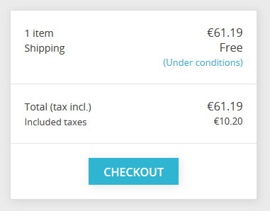
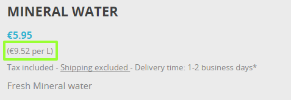

# Complying with the European legislation

## Introduction 

This guide is intended to European merchants and explains how they can configure their shop and make sure it's compliant with European e-commerce legislation. 

If you need information about the GDPR, you can check the doc right [here](http://doc.prestashop.com/display/PS17/Complying+with+the+GDPR). 

## Why you should bother about it 

If you're based in Germany, Austria or Switzerland, or intend to sell in those countries, making sure your shop is compliant with the legislation is a mandatory requirement. Failing to do so could expose you to prosecution fees. To avoid these prosecutions, certification companies like Trusted Shops, EHI, Händlerbund and Protected Shops can audit your shop and provide you with a certificate that proves you're in conformity with legal requirements.

PrestaShop 1.7 is already pre-certified by these 4 companies, which means it'll ease the process of getting the complete certification.  
To know more about 1.7, you may read: [https://www.prestashop.com/en/1.7](https://www.prestashop.com/en/1.7)

This pre-certification means that PrestaShop provides you with all the required features to be compliant. The configuration is then up to you!

## How to configure your shop 

The cornerstone of PrestaShop's compliance is the module "Legal Compliance" \(technical name: ps\_legalcompliance\), which allows you to do 90% of the set up for a compliant shop. Some other elements are not part of this module and can be configured separately. We will go through every aspect of the Legal Compliance module and these other elements.

### Configure the Legal Compliance module 

#### Installation 

Go to your back-office, in the Modules & Services page, and in the first tab "Selection" use the search bar to look for "legal compliance" and install the module.  
You can then go in the second tab "Installed modules" and click on the "Configure" button of the module Legal Compliance.

#### Pre-set elements 

When you install the Legal Compliance module, it actually triggers a lot of pre-configuration in order to save you a precious time. Here's the list:

* Several static pages are created, thus providing you the means to indicate legally required information to your customer. For more, see "[Legal content management](complying-with-the-european-legislation.md#ComplyingwiththeEuropeanlegislation-Legalcontentmanagement)".
* These static pages with legal content include a "Print" button, which allows customers to easily print or save in PDF this legal information.
* The [final summary](complying-with-the-european-legislation.md#ComplyingwiththeEuropeanlegislation-ordersettings) in the last step of the checkout is also enabled.
* The option '[Display tax in the shopping cart](complying-with-the-european-legislation.md#ComplyingwiththeEuropeanlegislation-taxsettings)' is enabled
* "Free" shipping conditions: sometimes, the default carrier of your default country may be free and this information is displayed on the shopping cart page even if you haven't set your address and delivery method during checkout. Because the final shopping cost depends on the address and chosen carrier the Legal Compliance module will automatically add a mention "under conditions" which links to the static page "Shipping and Payment" where you should write every detail of the shipping conditions and costs.  
* The opt-in for Terms of Services will also include the Revocation Terms \(if available\) during the checkout  

#### Configuration 

In this paragraph we'll go through every option inside the configuration page of the Legal Compliance module.

**LABELS**

**Delivery time label \(available products\)**

This is a global parameter that will be displayed on the detail page of every non-virtual product. We recommend you use a precise indication like "delivery time: 2 to 5 days" instead of vague indications like "delivered in 3 days in normal conditions".

In back-office:

In front-office:

**Delivery time label \(out-of-stock products\)**

Same as above but for out-of-stock products.

**Additional information about delivery time**

You may use this field to display additional information about the applicable conditions of the above-mentioned delivery time labels. For instance, the delivery time may only apply to Germany.  
A link to the static page "Shipping and Payment" is also automatically added so that the customer may have access to the complete information about the shipping conditions.

In back-office:

In product detail pages:

In the footer of product detail pages:

**'Our previous price' label**

When a product is on sale, this option adds the label 'Our previous price' before the crossed price. It thus allows you to explain that this crossed price comes from an active promotion and that it's not the manufacturer's recommended price nor the competitor's price.

In the product detail page:

**Tax 'inc./excl.' label**

This option displays whether the tax is included on the product page \('Tax incl./excl.' label\) and adds a short mention in the footer of other pages \(product listings\).

In product detail pages:

In the footer of product listing pages:

**Price per unit label**

When this option is enabled, the unit price \(price per kg, L...\) will be visible next to the product price if available. 

See how to set a unit price [here](complying-with-the-european-legislation.md#ComplyingwiththeEuropeanlegislation-priceperunit).

In the front-office:

**'Shipping fees excl.' label**

When enabled, this option displays a label "shipping excluded" both in product detail pages and in the footer of product listings. This "shipping excluded" label is a link to the static page "Shipping and payment", which is automatically created by the Legal Compliance module at its installation. Make sure the shipping and payment terms are associated to a [static page](complying-with-the-european-legislation.md#ComplyingwiththeEuropeanlegislation-Legalcontentmanagement).

In the product detail page:

In the footer of product listings:

**Revocation Terms within ToS**

This option will include the content of the revocation terms within the Terms of Service static page.

**Revocation for virtual products**

This option adds a mandatory checkbox at the end of the checkout process when the cart contains a virtual product \(either a service or a digital good\). It ensures that the client is aware that he loses his right to cancel once the download of digital good has begun or once the service has been fully performed.

**'From' price label \(when combinations\)**

If a product has combinations with different prices, this option adds a label "From" before the product price in product listings. Please note that the price displayed in product listings is not the lowest possible price but the default combination price.

In product listings:

**Custom text in shopping cart page**

This option allows you to add a custom text in the shopping cart, giving you the opportunity to inform the customers about how the order is legally confirmed and how the order data will be used and/or saved.

In shopping cart page:

**FEATURES**

**Enable 'Reordering' feature**

This option allows customers to re-order in one click from their Order History. Disable this option if it is considered as unsolicited goods in your local legislation.

**Proportionate tax for shipping and wrapping**

When this option is enabled, the tax for shipping and wrapping costs will be calculated proportionate to taxes applying to the products in the cart. It allows you to define a fixed tax included shipping cost for each carrier, while the tax rate is computed from the average cart taxes. This option substitutes the default behavior in which you define a tax excluded shipping cost and choose a fixed shipping tax rule.

When enabled, make sure that the shipping fees you set are tax included:

* carriers' shipping costs _\(in IMPROVE / Shipping / Carriers / your carrier\)_
* handling charges _\(in IMPROVE / Shipping / Preferences\)_
* additional shipping fees _\(in SELL / Catalog / Products / your product\)_

**LEGAL CONTENT MANAGEMENT**

Your country's legislation may require you to communicate some specific legal information to your customers, like your terms of service or revocation terms. For that purpose, you may use the static pages automatically created by the Legal Compliance module. It's your responsibility to fill these pages with the required legal content. For legal support about this content, you may get help from PrestaShop partners:

[https://www.prestashop.com/en/industry-partners/certifications/protectedshops](https://www.prestashop.com/en/industry-partners/certifications/protectedshops)

To complete these pages, go to IMPROVE / Design /  CMS and read more about [Managing Static Content](http://doc.prestashop.com/display/PS17/Pages+-+Managing+Static+Content).

The Legal Compliance has 7 pre-defined topics that serve different roles in different conditions. These topics are:

* Terms of Service \(ToS\)
* Environmental notice
* Legal notice
* Privacy
* Revocation terms
* Revocation form
* Shipping and payment

Each of these topics can be assigned with a static page that corresponds to this topic.

To ensure that other options like ['Shipping fees excl.' label](complying-with-the-european-legislation.md#ComplyingwiththeEuropeanlegislation-shippingexcl) or [Additional information about delivery time](complying-with-the-european-legislation.md#ComplyingwiththeEuropeanlegislation-additionaldelivery) link to the corresponding content, make sure you have assigned a static page to the topics.

You may also leave it empty if you don't need a legal topic. For instance you may not need an 'Environmental notice' if you don't sell electronics.

The links to these static pages will automatically be part of the footer of the front-office, thus accessible for your customers at any time. Which looks like this in the footer of the front-office:

**EMAIL CONTENT INCLUSION**

This section allows you to include information from the "Legal Content Management" section above at the bottom of your shop's emails. For each type of email, you can define which content you would like to include. By default, several legal contents are already pre-configured to be included in some email templates. Please note that the list of email templates in this section does not contains email templates from external modules.

### Configure other elements of PrestaShop 

#### Order settings 

**GENERAL**

**Enable final summary**

This option displays an overview of the order \(delivery and billing addresses, shipping method and cart content\) in the final checkout step before confirming the order. It allows your customers to check their order and modify it if needed. This summary is required in some European countries.

In the checkout process:

**Terms of service**

Enable this option to require customers to accept the terms of service during the checkout.

#### Product settings 

**Price per unit**

Depending on your local legislation, your may be required to display a unit price for products that can be quantified with volume or mass \(€/kg or €/L...\). You can set this unit price in the configuration page of your product:

**Product details summary**

In the shopping cart summary \(both in shopping cart page and [final summary](complying-with-the-european-legislation.md#ComplyingwiththeEuropeanlegislation-finalsummary)\), by default only product combinations attributes will be displayed in the cart summary. You might be required to display other relevant details about the product at this step. To add this information, a workaround is to create attributes for this purpose.

For instance, let's assume you're selling a television and need to display its diagonal in the shopping cart summary.

1. In SELL / Catalog / Attributes & Features, go to "Add new attribute", name it "Diagonal" with public name "Diag.", select attribute type "Radio buttons" and save.
2. Back in SELL / Catalog / Attributes & Features, click on the newly created attribute "Diagonal" in the table.
3. Then go to "Add new value", set up "138 cm \(55''\)" and save.
4. In SELL / Catalog / Products / Television, check the radio button 'Product with combinations' in the first tab 'Basic Settings"
5. In the second tab 'Combinations', check "138 cm \(55''\)" in Diag. \(or type it in the text bar\). Then generate the combination.
6. You now have an additional detail in the shopping cart summary:

#### Shipping settings 

**Custom carrier transit time** 

If you've created a custom carrier \(in IMPROVE / Shipping / Carriers\), you should make sure that the field **transit time** does not contradict the [delivery time label](complying-with-the-european-legislation.md#ComplyingwiththeEuropeanlegislation-deliverytime) you have set up with the Legal Compliance module.

**Special customs fees**

In countries like Switzerland, some additional fees may be added when the product crosses the border. To warn the customer about these fees, you may edit the transit time field of your Swiss carrier \(if you've created it manually\). 

#### Newsletter subscription 

You might need to add details about how the newsletter subscription can be canceled. For that purpose you may edit the text in "newsletter conditions" from the configuration page of the Email Subscription Form module:

In front-office:

#### Customer reassurance module 

This module displays more information to reassure your customers. It does not have any sample content by default but it is up to you \(and your legal team\) to fill it with the proper text. For instance, you may use it do display information about the return policy, the shipping fees and data security. Be careful not to put anything that could contradict other indications.

#### Bankwire module 

In some countries, when paying with bank wire, the customer doesn't have to pay until he receives his order confirmation. Make sure to switch off 'Display the invitation to pay in the order confirmation page' in the module's configuration page, so that the customer receives the invitation to pay by email only.

#### Tax settings 

**Display tax in the shopping cart**

In some countries you might be required to display the total tax amount in the shopping cart. To do so, make sure the option 'Display tax in the shopping cart' is enabled. It will display the total tax amount in a distinct line of the shopping cart summary.

#### Static pages 

\[to be completed\]

### External or nice to have elements 

#### Cookie law 

\[to be completed\]

#### Password security 

You may also be required to protect your customers against account-hacking and password-stealing. For that purpose you may buy a module on PrestaShop Marketplace:

[http://addons.prestashop.com/en/23824-login-sheriff-pro.html?pab=1&](http://addons.prestashop.com/en/23824-login-sheriff-pro.html?pab=1&)

#### Payment fees 

\[to be completed\]

#### Electronic products 

\[to be completed\]

## What is still your responsibility 

PrestaShop's core and native modules will allow you to comply with every functional requirements from the certification authorities.  
However there are some elements like content or external modules that are specific to your shop, and it is your responsibility to make sure they're compliant. These elements are:

* the legal content in static pages
* payment modules
* newsletter modules
* shipping modules

